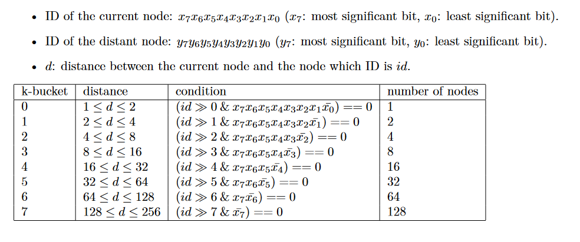

# kademlia-doc

This repository contains some scripts I have written in order to explore the Kademlia distributed hash table.   

Within this document we use the following terms:
* The _current node_ is the node we focus on. It is the node that is taken for reference for _indexing_ the nodes space
  (relatively to the _current node_).
* A _distant node_ is any other nodes than the current one.

And, for the graphical representations we assume that the node IDs are 5 bits long (instead of 160). 

# Math

Let `x` be a natural number encoded on `n` bits.

If `d(x,y)` is the distance between `x` and `y`:

# Kademlia nodes space

The image [kad-tree.gif](images/kad-tree.gif) shows:
* the _current node_ (which ID is `01010`) within the binary tree that represents the nodes space.
* the 5 successively lower subtrees that don't contain the current node.
  Each subtree is given a color (see [buckets.pal](scripts/config/buckets.pal)).
  The subtree that contains the unique current node is given the color `#00FF00`.
  The subtree that contains the 2 _distant nodes_ closest to the _current node_ is given the color `#C16CF2`...

> This image has been generated using the script [kad-tree.pl](scripts/kad-tree.pl): `perl kad-tree.pl --bits=5 --node=01010 --palette=config/buckets.pal | dot -Tgif -Ograph`

You can visualise the tree representations for all nodes within the nodes space:

[00000](images/tree-00000.gif), [00001](images/tree-00001.gif), [00010](images/tree-00010.gif), [00011](images/tree-00011.gif), [00100](images/tree-00100.gif), [00101](images/tree-00101.gif), [00110](images/tree-00110.gif), [00111](images/tree-00111.gif), [01000](images/tree-01000.gif), [01001](images/tree-01001.gif), [01010](images/tree-01010.gif), [01011](images/tree-01011.gif), [01100](images/tree-01100.gif), [01101](images/tree-01101.gif), [01110](images/tree-01110.gif), [01111](images/tree-01111.gif), [10000](images/tree-10000.gif), [10001](images/tree-10001.gif), [10010](images/tree-10010.gif), [10011](images/tree-10011.gif), [10100](images/tree-10100.gif), [10101](images/tree-10101.gif), [10110](images/tree-10110.gif), [10111](images/tree-10111.gif), [11000](images/tree-11000.gif), [11001](images/tree-11001.gif), [11010](images/tree-11010.gif), [11011](images/tree-11011.gif), [11100](images/tree-11100.gif), [11101](images/tree-11101.gif), [11110](images/tree-11110.gif), [11111](images/tree-11111.gif)

The image [kad-grid-buckets.gif](images/kad-grid-buckets.gif) shows the contents of the 5 successively lower subtrees for all nodes within the nodes spaces.
The number in parentheses (in the rectangles that represent distant nodes) is the distance between the _distant node_ and the _current one_.
For example, the distance between the (current) node `00010` and the (distant) node `00001` is `3` (`b00010 xor b00001 = b00011`, which is `3` in decimal). 
Please note that the colors match the ones used for the previous image ([kad-tree.gif](images/kad-tree.gif)).

> This image has been generated using the script [kad-grid.pl](scripts/kad-grid.pl): `perl kad-grid.pl --palette=config/buckets.pal --type=buckets | dot -Tgif -Ograph`

The image [kad-grid-peers.gif](images/kad-grid-peers.gif) is similar to the image [kad-grid-buckets.gif](images/kad-grid-buckets.gif).
The difference is that each node is given a unique color (see [peers.pal](scripts/config/peers.pal)). For example, the node `11111` is given the color `#8d9150`.

> This image has been generated using the script [kad-grid.pl](scripts/kad-grid.pl): `perl kad-grid.pl --type=peers | dot -Tgif -Ograph`

# The routing table

## The k-buckets

A bucket may contain up to `k` nodes.

The number of buckets is equal to the number of bits used to represent a node ID.

Let's say that a node identifier is encoded on 8 bits (`id_length = 8`). In this case, the routing table contains 8 buckets.

* The first column represents the bucket's index.
* The second column represents the distance between the current node and the node which ID is `id`.
* The third column represents the _condition_ that must be verified by `id`.
* The last column represents the number of nodes which IDs verify the _condition_.

# Links

* [Kademlia: A Design Specification](https://xlattice.sourceforge.net/components/protocol/kademlia/specs.html)

